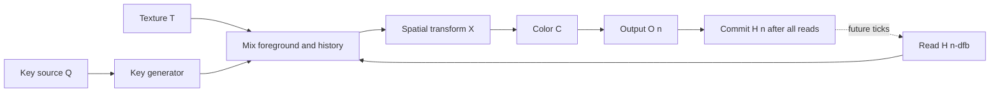
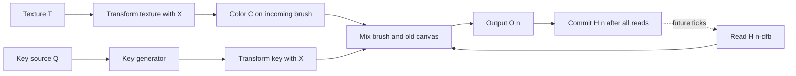
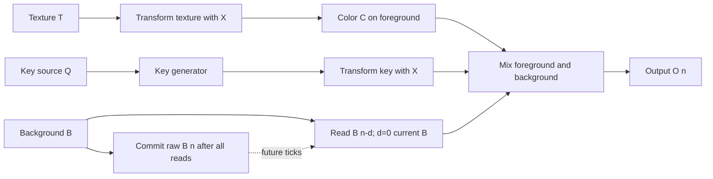
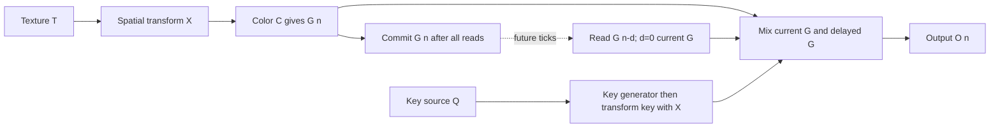

# RVX Memory Palace behavior sheet

Specification for issue #6, reviewed against primary sources on September 7, 2026. This is a proposed RVX instrument, not an implemented Memory Palace emulation. It preserves the four named workflows, the panel's control families and the distinction between video signals and slower control voltages. It does not establish firmware, pixel, circuit or analog I/O equivalence.

The selected comparison target is **LZX Memory Palace V19 / package 1.9.0**, identified below. This is an intentional historical target, not a claim that V19 is the latest firmware. The later 2.0.2 package and changes were also audited. A future reference change must update this sheet and its fixtures together. The first-release requirement remains an integrated memory instrument; a generic feedback shader does not satisfy it.

## 1. Evidence and revision boundary

**D** means documented by the cited primary source, **P** means a proposed RVX rule, and **U** means unresolved hardware behavior. D establishes what the source says, not that hardware was tested. All numeric/image tests below are unrun acceptance criteria. The catalog's functional feasibility grade B is an engineering estimate; it is not a fidelity score.

| ID | Primary reference and inspected revision | Use and limits |
|---|---|---|
| S1 | [User Guide, post 1](https://community.lzxindustries.net/t/memory-palace-user-guide/884/1), by Lars Larsen; created 2019-01-27, post ID 3933, edit version 30, updated 2022-02-10 19:40:30 UTC | Main ranges, four paths, source routing and frame-sampled controls. The post calls itself a prototype guide and has no firmware-version label. Its 2022 edit is not a contemporaneous V19 snapshot. |
| S2 | [User Reference Sheet](https://github.com/lzxindustries/lzxdocs/blob/83dd46578b5ea394816b4151b791355cbbb3a345/static/pdf/memory-palace/memory-palace-user-reference-sheet.pdf), first printing December 2018, both pages inspected | Physical layout and connector/control inventory. SHA-256 `a9cfaf342a8448f98ea91e0fb1348295b0f540d2fb6331a3077d7de1bb069354`. The legend reverses the green/blue input/output names relative to the pictured banks; preserve the pictured YRGB output and ARGB input banks, not that apparent legend error. |
| S3 | [V19 release thread](https://community.lzxindustries.net/t/memory-palace-v19-firmware-release-march-2020/1948), especially LZX staff posts [43](https://community.lzxindustries.net/t/memory-palace-v19-firmware-release-march-2020/1948/43), [57](https://community.lzxindustries.net/t/memory-palace-v19-firmware-release-march-2020/1948/57), [59](https://community.lzxindustries.net/t/memory-palace-v19-firmware-release-march-2020/1948/59), [115](https://community.lzxindustries.net/t/memory-palace-v19-firmware-release-march-2020/1948/115) | Release context; Freeze inhibits painting in post 43, Clear removes the frozen image in post 57, while key settings can replace the background. Post 115 describes recent-input looping but dates from November 2020, after discussion of V20 beta began; do not automatically attribute it to final V19. |
| S4 | [V19 beta announcement](https://community.lzxindustries.net/t/memory-palace-v19-beta-dec-2019/1774/1), 2019-12-24 | Documents faster recursion, vertex features and beta defects. A beta feature announcement does not prove every detail of final V19. |
| S5 | [All About Memory Palace](https://community.lzxindustries.net/t/all-about-memory-palace/1350/1), 2019-07-23 | Historical support for transform placement after the keyer in feedback, before the keyer in painting; color changes can recur each pass. Contains obsolete/pre-release names and Freeze/Clear descriptions. |
| S6 | [A Keying Dictionary](https://community.lzxindustries.net/t/a-keying-dictionary/3909/1), Lars Larsen, 2022-06-05, and [threshold explanation](https://community.lzxindustries.net/t/a-keying-dictionary/3909/4) | Identifies Memory Palace's digital soft window keyer; supports center ± half-width thresholds. Does not publish its exact softness or chroma algorithm. |
| S7 | [MIDI discussion](https://community.lzxindustries.net/t/memory-palace-feature-request-midi/1865), designer posts 6, 9, 11 and 14, 2020-02-15 | Frame-batched parameter updates and 14-bit CC handling; distinguish implemented statements from proposed additions in the conversation. |
| S8 | [2.0.2 changelog](https://community.lzxindustries.net/t/suggestion-for-memory-palace-firmware/3225/61), [frame/field explanation](https://community.lzxindustries.net/t/suggestion-for-memory-palace-firmware/3225/66), [2024 release notice](https://community.lzxindustries.net/t/suggestion-for-memory-palace-firmware/3225/93) | Later revision delta: vertex resolution, progressive warp, underscan/file-count fixes; 2024 package adds a screen saver. Not silently incorporated into the V19 target. |

The selected [1.9.0 package](https://github.com/lzxindustries/firmware/blob/cc0277ef6c7cce81ad8b1c19bf3fabf240df3ee3/memorypalace_1.9.0/memorypalace_1.9.0.zip) has SHA-256 `644b6e67c107a71c9f06070a7fe9550896dbb89bb59fe0b1f111981558fa84f2`; its `BOOT.bin` has SHA-256 `90f58b9b6c7e30c1971522478a4ee277da36c8efe28dedd791878dc1a01ee134`. The inspected [2.0.2 package](https://github.com/lzxindustries/firmware/blob/cc0277ef6c7cce81ad8b1c19bf3fabf240df3ee3/memorypalace_2.0.2/memorypalace_v2.0.2.zip) has SHA-256 `b0b01512c6e150e6cfaf015b1e68a664e1009f80a1673414108274bed57f9da9`; its `BOOT.bin` has SHA-256 `279e1e9a5668e55b5d8c361cc201551a706d00f482d1973292f97a085d8ecdb8`. These are artifact identities, not executed firmware or accessible algorithm source. The per-version update PDFs share the same Git blob and are not version-specific behavior manuals. Downloaded caches stay outside Git.

**Source conflicts remain visible.** S5 describes freezing all memory and erasing the canvas; S1/S3 describe input capture and unfreeze. S1's A/B preset description is incomplete alongside later animation behavior. S1 names a 720×480 NTSC buffer but recommends 720×486 media; S8 describes 486-line frames and 243-line fields. Consequently, neither active-height cropping nor every control's historical behavior can be inferred from a product name or version string alone.

## 2. Controls, ports and normalizations

Retain S2's left-to-right arrangement: AUX; color; key; delay; spatial controls. Every slider has its own input and VC-level attenuator. AUX is the thirteenth slider and accepts a **video field**; it must not be folded into the twelve slower parameter inputs. S2 also shows thirteen illuminated performance buttons, a menu display and four navigation buttons.

The following **D ranges** come from S1. RVX center/default choices in the third column are **P**, not factory calibration data. Static engineering units must appear in parameter readouts.

| Slider | D range | P initial value / mapping from normalized slider `u∈[0,1]` | U |
|---|---|---|---|
| Hue | −360°…+360° | 0°; `720u−360` | Hue/color implementation |
| Saturation | 0…200% | 100%; `2u` | HSV/YUV law, limiter |
| Contrast | 0…200% | 100%; `2u` | Gain versus midpoint contrast |
| Width | 0…100% | 100%; `u` | Endpoints and softness interaction |
| Center | 0…100% | 50%; `u` | Threshold overflow behavior |
| Softness | 0…100% | 0%; `u` | Transfer curve |
| Delay | 0…60 frames | 0; `floor(60u+0.5)` | Hardware bins and frame/field units |
| Zoom | 50…200% | 100%; `2^(2u−1)` | Actual hardware curve |
| Aspect | −100…+100% | 0%; `a=2u−1` | Meaning of aspect endpoints |
| Rotation | −180°…+180° | 0°; `360u−180` | Direction/pivot |
| X Position | −360…+360 pixels | 0; `(2u−1)W/2` | Display/pixel convention |
| Y Position | ±240 NTSC / ±288 PAL pixels | 0; `(2u−1)H/2` | Active height convention |
| AUX | U numeric endpoints | 0 additive offset | Range, clipping, displacement scale |

S1 documents 12-bit internal parameter resolution, summed slider/CV/MIDI contributions and frame-start CV sampling. It names tuning controls Offset, Slew, Null gap, S-curve and CV polarity. S7 supports CC MSB/LSB pairs and frame-batched MIDI handling. Numerical filter constants, deadband widths, transfer curves, calibration and the order of tuning stages are **U**. RVX must not label an arbitrary easing curve as the LZX S-curve.

| Interface | D physical function (S1/S2) | P RVX connection / absent-input rule |
|---|---|---|
| A, R, G, B inputs | Four synchronized 1 V video channels | Four field inputs; unpatched RGB = 0, A = 1. These defaults are not verified hardware normalizations. |
| AUX input | 1 V full-bandwidth video; Alpha/Mesh/Mask roles | Separate field, absent = 0; dedicated gain and offset. No frame latch on its pixels. |
| Twelve VC inputs | One per non-AUX slider, attenuated | Ordinary Rack voltages captured for parameter sampling; absent contribution = 0. |
| Trigger/Gate | Assignable performance event | One native gate input; rising-edge event capture, absent = no events. |
| Y, R, G, B outputs | Component video | Four fields extracted from completed output; proposed luma weights in §4. |
| DVI-D, two CVBS, S-Video | Video outputs | Shared RVX Image output; actual Syphon/NTSC encoding uses suite I/O modules. No electrical connector emulation. |
| MIDI In/Thru | MIDI control | Rack MIDI assignment layer/host mapping; exact note-off and boolean CC compatibility remains U. |
| USB/storage; rear sync | Media transfer; hardware synchronization | File selection and engine timing settings. No USB-disk or hardware-genlock claim. |

A bundled Image input is a **P convenience**, converted to the component bank through shared split/combine operators: connected component cables override corresponding image channels; missing components use the image channel, then the defaults above. The Image port is not an additional hardware source. Native audio cables cannot carry these image/field references. The hardware default voltage scale and jack normalizations need measured or version-specific evidence; the historical overview's 1 V/5 V claim is not a calibration specification.

For ordinary Rack CV, the **P initial scale is 10 V per complete slider travel**, consistent with the prototype's 10 V = 1 video-unit bridge; it is not a hardware-equivalent CV default. Provide an explicit reference-scale option once the actual signed/unipolar hardware calibration is resolved. Each attenuator ranges 0…1 with a separate polarity selection; do not replace it with an unmarked attenuverter.

| Button family | D role (S1/S2 unless noted) | P state handling |
|---|---|---|
| A/B | Two option configurations; later animation use is revision-dependent | Two saved option banks in the basic profile; animation uses a separately identified profile, §8 |
| Freeze / Clear | Input capture / release, S1/S3 | Commands, not a generic freeze toggle; §7 |
| Colorize, Scan, Spin, X Scroll, Y Scroll | Hue, Center, Rotation, X, Y motion enable | Independent phase states, §6 |
| Invert | Key polarity | `k←1−k`, after key generation |
| Tile, Reflect | Spatial border behavior | Independent stored booleans, combined rule in §5 |
| X Mirror, Y Mirror | Axis mirroring | Preserve independent controls; exact fold mode/polarity U |

## 3. Source selection and four routing graphs

**Notation and proposal boundary.** `L[n]` is the current live ARGB image after input-capture selection; `M[n]` is selected media. `T` is texture, `Q` is the source for key extraction, `B` is a background; `K(Q)` is key generation, `Mix(T,B,k)=kT+(1−k)B`, `X` is spatial resampling, `C` is color processing, and `H` is immutable prior history. The same key linearly mixes all four channels; an alpha key is not multiplied into RGB a second time. This is signal crossfading, not Porter–Duff over.

All four graphs and equations below are **P precise evaluation rules**. S1 supports their broad workflows, S5 supports the historical Warp/Paint ordering, but no inspected source proves every tap, color position or Scene assignment for final V19. Those disputed details are U1; a render matching these graphs proves RVX consistency only.

| Route selector | D texture/key-source pairing (S1) | P Scene background |
|---|---|---|
| ARGB | `T=L`, `Q=L` | Untransformed `L` |
| Media | `T=M`, `Q=M` | Untransformed `M` |
| ARGB/Media | `T=L`, `Q=M` | `M` |
| Media/ARGB | `T=M`, `Q=L` | `L` |

For **Warp**, newly keyed material and the retained image undergo the spatial/color pass together before storage. Injecting a mark moves it on its first pass; the same transform/color pass recurs on later feedback visits. This preserves S5's after-keyer historical ordering instead of substituting a transform of only the old background.

`O[n]=C(X(Mix(T[n],H[n−dfb],K(Q[n]))))`; commit `H[n]=O[n]`. The key is computed before color and transform. Color sits inside the recursive loop (**P**); its precise relation to the key/transform on hardware remains U1.

For **Paint**, only the incoming brush moves. Previously deposited marks remain in canvas coordinates. Transform the already generated key with the same sampling coordinates as the brush so transparent borders do not paint black rectangles.

`O[n]=Mix(C(X(T[n])),H[n−dfb],X(K(Q[n])))`; commit `H[n]=O[n]`. Color is applied to newly deposited material only (**P**). With `dfb>1`, separate temporal canvases interleave; do not silently turn the feedback store into a one-frame accumulator while calling the control Delay.

For **Scene**, apply the same foreground transformation, then composite over a source background. There is no output recurrence. The proposal puts Delay on the background; the foreground remains current. This placement and the source table's background column are **U on hardware**, not consequences of the slash notation.

`O[n]=Mix(C(X(T[n])),D_d(B)[n],X(K(Q[n])))`; history stores `B[n]`, never `O[n]`. Thus Invert selects the other layer, without turning Scene into painting.

For **Ghost**, transform/color the source once, then compare current and delayed versions of that processed source. The delayed copy retains the transform/color settings from its acquisition tick. Current settings must not re-transform the history on every read. S1 supports processing a source before a temporal keyer; this exact color/key tap is **P**.

`G[n]=C(X(T[n]))`; `O[n]=Mix(G[n],D_d(G)[n],X(K(Q[n])))`; commit `H[n]=G[n]`. With an unchanged source and unchanged settings, Ghost converges to one image; it does not generate indefinite recursive trails.

## 4. Key and color operator contracts

**P initial mathematical profile, hardware laws U2.** Work in encoded RGB, with signed finite intermediate values. Use the shared RGB/component conversion boundary; do not let display gamma or a texture's format introduce an undocumented conversion. For the diagnostic luma key/output use `Y=0.299R+0.587G+0.114B`, explicitly a chosen coefficient set rather than a measured Memory Palace matrix.

Detect nonfinite inputs or generated state, replace affected samples with zero and count a diagnostic before committing history. Finite negative and above-white RGB remain valid. Key weights alone are intentionally bounded 0…1; display/export conversion is an explicit downstream boundary. Any additional reference color limiter must be named and calibrated as part of U2.

For luma or alpha, let `v` be selected Y or A. In AUX Alpha mode add the AUX field/gain/offset to A before alpha-key generation, never to luma/chroma. `lo=center−width/2`, `hi=center+width/2`; this threshold structure is supported by S6. Proposed soft window: at softness zero use `lo≤v≤hi`; otherwise `k=clamp(0.5+(v−lo)/s,0,1) × clamp(0.5+(hi−v)/s,0,1)`, with `s=softness`. Do not pre-clamp thresholds to 0…1. The multiply, equality convention, and softness scale are RVX assumptions. This candidate may fail the hardware's full-softness crossfade behavior; do not call it final calibration.

Chroma is **not specified as a substitute hue-distance formula**. S1 identifies UV components but does not state whether Center/Width act on angle, magnitude, a projection or another derived value. Keep a distinct `ChromaKey` operator contract, with parameter/timing interface matching the other keys; its reference transfer function is a blocking U2 before claiming the chroma mode complete. A development fallback, if later authorized, must be named in its results and cannot pass the hardware gate.

`C` keeps Hue, Saturation and Contrast independently addressable. Identity settings must be an exact no-op for finite signed inputs. A candidate CPU reference for nonidentity settings is HSV hue rotation and saturation scaling, followed by RGB gain for Contrast; do not bake it into generic Proc, Swatch or an output clamp. Contrast's pivot, HSV versus component processing, negative-value handling, channel limiting and quantization sites remain U2. Colorize means motion of Hue, not automatic monochrome tinting.

The integrated instrument needs luma, chroma and alpha modes to satisfy the release requirement. Keeping an unresolved algorithm visible is not permission to ship without it or to declare a self-generated golden image evidence of LZX fidelity.

## 5. Coordinates, interpolation, borders and AUX geometry

**P affine reference.** Use pixel centers and a top-left origin. Represent positions in display space `((x+0.5)/W−0.5)×displayAspect`, `(y+0.5)/H−0.5`; thus rotation respects the selected 4:3 or 16:9 display aspect. Center the pivot. Apply local axis scales, then rotation, then translation in forward coordinates; render by inverse mapping. Positive X goes right, positive Y down, positive rotation clockwise. Aspect's provisional scales are `sx=zoom×2^a`, `sy=zoom×2^(−a)`. This finite law avoids a singular endpoint but is not a hardware endpoint claim.

For a source coordinate `q` normalized across an axis, these are distinct **P** modes:

| Tile | Reflect | Proposed source-coordinate behavior |
|---|---|---|
| off | off | Outside frame = transparent black; key mask outside = 0 |
| on | off | Repeat: `q−floor(q)` |
| off | on | Clamp to the nearest edge sample |
| on | on | Alternate reflected tiles: `1−abs((q−2floor(q/2))−1)` |

S1 supports repeating and extending borders, but does not prove this complete truth table. X/Y Mirror are separate spatial folds, not aliases for border extension: proposed fold is `q←abs(2q−1)` on the selected axis after border resolution. The original guide's axis wording and S4's selectable mirror modes leave exact orientation, fold origin and options U3. Test all sixteen Tile/Reflect/X-Mirror/Y-Mirror combinations; no driver default wrap mode may determine behavior.

Use bilinear sampling as a **P comparison baseline**, with nearest sampling exposed as an explicitly different option. Resample signal R/G/B/A independently; alpha zero must not destroy an independently patched RGB voltage. Scalar key fields use the same coordinates, with outside-frame key zero preventing a painted border. Associated-alpha filtering belongs only to an explicitly selected media-coverage import profile, not the general signal processor. These choices may differ from hardware resampling. Clamp edge *tap indices* for edge extension; wrap/reflection must apply to each contributing tap at a seam. Neither arbitrary antialiasing nor noise may be presented as hardware character.

AUX Mesh and Mask are required named modes, not extra scalar CVs. S4 documents vertex displacement/capture and masking, and confirms displacement mapping in its designer reply. The X/Y association of Alpha and AUX, mesh density, displacement gain, vertex capture timing, filter-mask bits and Screen/Vertex options remain U3. Proposed reuse boundary: `CoordinateMesh` accepts two full video fields and returns coordinates; `VertexMask` controls coordinate precision; neither may be approximated by a single frame-average value. These two modes require a further sourced/calibrated geometry table before their fidelity gate can pass.

## 6. Frame sampling, motion and event timing

The **P first RVX profile** uses 720×480 progressive images at `30000/1001` ticks/s, matching the independently developed issue #13 prototype. PAL comparison uses 720×576 at 25 ticks/s. These are explicit working-image profiles, not interlaced hardware timing.

There is a material timing mismatch to resolve: S4 advertises 60 Hz recursion, while S1/S7 describe frame-rate parameter updates. S8 later distinguishes recursive field processing from progressive frame processing. **Do not infer that every history advance, control latch and display refresh uses the same clock.** The reference gate must identify each separately, including odd/even ordering, before a V19 timing-fidelity claim. Increasing an RVX texture clock to 60 Hz without field metadata does not solve it.

For reproducible RVX tests, `n` counts successfully completed image updates; `t[n]` is their boundary on the rational schedule. In an on-time run `t[n]=n×1001/30000` for the NTSC-class profile. A skipped scheduled slot creates no synthetic history entry: record its gap, retain completed-image ages, and integrate motion over the actual boundary-time difference. Sample each parameter from the newest captured value at or before that boundary; hold it through the image. Queue discontinuities are reported. AUX/video fields stay spatially varying. Latch mode/source changes atomically with controls. Audio-derived images enter through the existing bridge; ordinary slider CV is not secretly audio-to-raster conversion.

Proposed tuning order is slider curve/deadband/offset → add attenuated signed CV and latest MIDI contribution → clamp normalized value → optional quantization → optional slew → physical units. Default tuning is zero offset/deadband/slew and identity curve. The hardware's 4096-value statement does not determine its bipolar zero code or rounding; optional RVX quantization is an identified experiment, not an exact emulation switch. Store units and mapping schema with presets so later calibration does not silently change old patches.

Each motion enable changes its named slider from position to signed rate. Proposed rates are in turns/s for Hue/Rotation, cycles/s for Center, and frame-widths/frame-heights per second for X/Y. Magnitude is a configurable RVX scale, initially 1 at full signed travel; **hardware maximum rates U4**. Integrate `phase += rate×Δt` from the latched rate. Hue and rotation wrap, Center uses a triangle sweep, X/Y translations wrap across their static spans. These waveform/wrap choices are P. Enabling motion seeds phase from the current static value; disabling returns to the static slider value and may jump. Freeze does not stop these clocks.

Buttons/gates/MIDI produce timestamped commands; ordinary toggles use event parity (XOR) at a shared boundary. Freeze/Clear remain ordered commands rather than toggles. Proposed same-timestamp order is panel, gate, MIDI, then sequence within producer; this is a deterministic tie-break, not measured firmware priority. Rising gates are captured in the audio callback with bounded nonallocating work. A short pulse cannot disappear between video ticks. A 128-event queue drops newest on overflow and counts loss; events from an old reset epoch cannot fire later. Raw gate threshold/hysteresis and MIDI note-off semantics remain U4.

## 7. History, delay, capture and lifecycle

**P exact progressive indexing.** A feedforward delay reads `D_0(S)[n]=S[n]`, `D_d(S)[n]=S[n−d]` for integers 1…60. Missing prehistory is transparent black. Warp/Paint use `dfb=max(1,d)` and visibly report the effective delay; a requested zero therefore means a **one-tick causal recurrence**, not zero-latency hardware equivalence. Delay 1 and 0 have the same feedback age in this proposal. Whether hardware instead adds the selected delay to an unavoidable base interval is U5.

A [later designer explanation](https://community.lzxindustries.net/t/lzx-module-releases-preview-2022/3910/34) describes temporally separated foreground/background with one frame delayed. This supports causal storage in principle; it does not resolve V19's displayed-zero mapping or field/frame units.

At each tick: apply clear/reset commands; snapshot all valid old history; render all reads/composites; then commit each ring once. With capacity 60 and next write index `w`, age `d≥1` reads `(w−d+60)%60`; commit at `w`, then increment modulo 60. Valid-count checks prevent wraparound into uninitialized samples. Age 60 is read before its slot is overwritten. Current feedforward data is a separate transient and is never falsely addressed as ring age zero.

At the NTSC-class progressive rate, 60 ticks are `60×1001/30000 = 2.002 s`; one tick is about 33.367 ms. At 25 ticks/s, 60 ticks are 2.4 s. These durations are RVX calculations, not measurements of V19 Delay. Display actual completed-history age when deadlines are missed; do not claim skipped scheduled ticks contained captured pictures.

| Action/state | Proposed exact behavior | Reference boundary |
|---|---|---|
| Live | Sample latest completed ARGB source into `L[n]` each tick | Image arrival and clock are distinct |
| Freeze from live | Capture one complete ARGB input snapshot and enter frozen-input state | S1; not an output screenshot |
| Freeze while frozen / Capture | Replace frozen input with a new complete ARGB snapshot; remain frozen | S1; expose Capture as secondary alias, retain primary Freeze label |
| Clear / Unfreeze | Release frozen input; current live source resumes; history/canvas remains | S1/S3; secondary Unfreeze alias |
| Erase History | Fill history with transparent black, valid count zero; keep frozen source and controls | RVX additional command, distinct label; applied before reads |
| Reset | Reset parameters/motion/events, release frozen capture, erase history, reload configured media safely | RVX module lifecycle, not hardware firmware reset |
| Bypass | Pass selected texture through; suspend history writes, advance motion clocks, discard performance commands except Reset; on exit erase temporal history, keep the frozen source and media | RVX proposal; a bypassed module cannot legalize a graph cycle |
| Route/path change | Apply new bank atomically; clear ring when path or route changes because stored quantities differ; preserve input capture | RVX proposal; no cross-contamination between canvas and raw background stores |
| Format/time discontinuity | Clear incompatible history/capture and start a new timing epoch; notify; preserve media identity and rescale from original asset | RVX proposal |

An Erase History tick may already show and commit fresh foreground. With a closed key/black source it remains blank; with an open key it immediately paints again. This distinction needs a test, not an extra hidden blank frame. Clear never silently erases history.

Capture uses the source snapshot available at its consumption boundary; multiple capture events within one tick can be recorded but cannot manufacture distinct camera frames. If the live input is missing, apply the upstream I/O's saved missing-source policy, record capture provenance, and do not invent a successful new-source capture. A frozen live source does not stop media playback or recursive history writes in this basic profile.

This input-capture model is specifically a proposal based on S1. S3 post 43 also describes Freeze preventing further painting, which may imply different write gating or buffer ownership. Capturing a brush and continuing to move it could expose that difference immediately. U6 must resolve this before the Paint Freeze behavior can be called V19-equivalent.

## 8. Media and contextual animation

S1 lists BMP/JPEG/PNG/nonanimated GIF, optional PNG/GIF alpha, 32 folders, 64 images per folder and a 2 MB file limit. The V19 beta announcement S4 also describes smaller images up to 720×576; S8 changes file-count failure handling. These are historical reader limits, not a requirement to reproduce ignored files or crashes.

**P media import:** decode off the audio/video threads; validate dimensions and byte budget before allocation; atomically replace the media slot only after success. Unsupported/corrupt assets retain the prior successful image and display an error. Initial empty media is transparent black. Unprofiled files use the declared encoded-RGB working convention; convert declared profiles explicitly at import, retaining the original for resize. For PNG/GIF retain alpha; formats without alpha supply one. Use contain/center with transparent padding by default, with saved crop/stretch alternatives. Asset resize, EXIF orientation, transfer conversion and the 480/486 crop are part of the import profile and test fixture.

Keep **single still**, **ordered still sequence**, and **captured live history playback** distinct. LZX staff describe animation from up to 64 numbered still frames, with A/B and Delay changing meaning outside Warp ([external-video discussion, post 2](https://community.lzxindustries.net/t/can-memory-palace-take-external-video-source/2132/2)); S3 post 115 describes looping recent RGB. Those contextual behaviors prevent treating A/B as universally a preset toggle or Delay as universally a temporal age. Exact final-V19 mode tables are U6.

Required follow-on reference coverage: in each of Warp/Paint/Scene/Ghost × live/media/mixed routes, identify whether A/B selects options, starts playback or selects a capture state, and whether Delay selects age, frame index or speed. Record playback direction, end wrapping, selected-frame offset, Freeze interaction and 64-frame versus 60-delay capacity. The basic progressive graphs in §3 cover single-still/live processing only; they do **not** claim to complete these animation workflows.

A proposed reusable sequence service can hold 64 identified images, use explicit frame-index or rate modes, and expose timestamped selection without altering the four compositor graphs. Its stored sequence is separate from the 60-frame feedback ring. Do not assign a guessed contextual mapping to the primary A/B/Delay controls before U6 is resolved. This is retained Memory Palace scope, not a substitution with a generic movie player.

## 9. Persistence and resource limits

**P default patch recall** stores controls, tuning, A/B banks, source/route/key modes, geometry profile, media identity/import settings and schema version. It starts with empty live history and a live input state; save a diagnostic if a saved reference cannot be found. No mutable cache path serves as durable media identity. Optional embedded capture/sequence/history uses versioned patch assets with format, source, tick/epoch, age order and checksum. Restoring settings and restoring pixels are separate operations. Duplicate instances have independent state and memory ownership; random seeds, if introduced later, are saved explicitly.

Use a shared budget service and immutable frame references. At 720×480 a four-channel float32 frame is 5,529,600 bytes. Sixty frames require **316.40625 MiB**; float16 would require 158.203125 MiB. At 1920×1080 float32 history alone requires about **1898.4375 MiB**. These are arithmetic capacity estimates excluding capture, sequences, transform/key workspaces, previews, import copies and backend surfaces. A 64-frame SD float32 sequence adds 337.5 MiB and must not be allocated in addition to the history without admission control.

The unmerged prototype's 512 MiB estimate is patch-wide, not a new per-Memory-Palace allowance. Proposed admission reserves worst-case simultaneous old/new generations before changing format or enabling history/media capacity, accounts unique shared buffers once, and rejects requests before mutation if over budget. Do not silently reduce delay, sequence length or resolution. Releasing an instance must release its ring and asset references; external consumers retaining frames need separate RSS diagnostics. Format changes under a tight budget may release old state before allocation only after the explicit clear policy is visible.

## 10. Reuse and integration boundary

Inspected the separate issue #13 prototype at commit `8a06c1d1f3ce17aff73cc0ca22712f25831a8534`: `docs/PROTOTYPE.md`, `src/core/Video.hpp` and relevant `src/core/Video.cpp` paths. It was developed under separate coding approval and is **not represented as merged into this specification branch**. This issue changes no plugin code or dependencies.

| Boundary | Existing prototype evidence | Required Memory Palace extension / ownership |
|---|---|---|
| Frame/field values | `Frame`, `FramePtr`, typed Image/Field ports, float storage | Reuse representation and explicit component conversion; add field parity only with a real timing contract |
| History scheduling | Delay reads old state before commit; clear gate; one stored frame | Extract bounded multi-age history and validity accounting; integrated instrument owns source/canvas routing, never 60 copies of a full Rack module |
| Parameter capture | Latched CV; bounded audio queue; trigger counter | Twelve independent controls plus ordered action events and bank snapshot; current eight-parameter array is insufficient |
| Transform | No Memory Palace spatial processor | Shared coordinate/resample/border/mesh operators, with module-specific laws and mode tables |
| Key/color | Prototype arithmetic/extraction only | Shared window/fader/color primitives; distinct chroma and color profiles; do not claim the Processor already implements them |
| Media | No still loader contract implemented | Async decoder/asset service, owned snapshots and budget admission |
| Feedback extensions | Typed graph, explicit delayed edges | Expose composable equivalents so Encoder → Dirty Mixer → Receiver can sit inside a causal feedback loop; label their added latency |
| Lifecycle/I/O | Worker owns rendering/history/I/O; inert native video voltages | Reuse worker ownership and Syphon boundary; no file loads, allocations, render waits or SDK calls in audio processing |

The integrated instrument is a composition/configuration of these operators, with Memory Palace-specific routing and state. Separate utility modules should call the same numeric operators. No inspected primary source provides reusable Memory Palace firmware algorithm code or permission inferred from the presence of downloadable binaries; binary availability does not establish a source-code reuse license.

## 11. Representative patches and acceptance matrix

Each fixture must save the RVX schema/reference profile, format/rational cadence, all controls/booleans/tuning, input frame sequence, gate/MIDI timestamps, expected age markers, source/import metadata and numeric tolerances. Use simple analytic fields and visible frame-number markers before footage. Hardware comparison additionally records physical patch, firmware package identity if known, sync topology, output connector and capture/deinterlace chain. No captured hardware evidence was produced in this session.

Unless a row overrides them, use identity color/geometry, all motion and border buttons off, nearest sampling for exact pixel-marker checks, and Alpha key with Width=1, Center=1, Softness=0. This selects fixture alpha one while rejecting alpha zero under the declared candidate window. Markers and numbered source frames use alpha one; empty input fixtures use alpha zero. These are test settings, not claimed factory presets.

| Patch / gate | Setup | Testable expected result | Evidence type / unresolved gate |
|---|---|---|---|
| MP01 — identity | Scene, identical live texture/background, no transform/color, Invert toggled | Current input reproduced at d=0 regardless of k; no double alpha attenuation | P numeric; float32 CPU tolerance ≤1e−6 for normalized finite fixture values |
| MP02 — Warp trail | One colored mark at tick 0, then alpha-key-closed black; X translation +1 pixel, d=1; nearest sampler | Mark at +1 pixel on tick 0, +2 on tick 1; each revisit applies C once | P graph oracle; D historical order; U1 hardware tap |
| MP03 — Paint drawing | Moving isolated brush, d=0 effective 1; later stop injection and move X | Old marks stay fixed; new deposits follow X; no transparent-border rectangle | P numeric/reference image; hardware interpolation U3 |
| MP04 — interleaved paint | Single mark, then key closed; d=3 | Three-tick recurrence; intervening canvases stay empty initially | P exact history; U5 hardware units |
| MP05 — Scene layers | Distinct live/media frame markers, mixed route; d=2; sweep alpha key/invert | Foreground follows current source; background marker age exactly 2; no accumulating output | P proposed mapping; U1 hardware layer assignment |
| MP06 — Ghost | Moving bar with frame ID; d=0,1,2,60; change rotation midway | d=0 branches identical; old branch carries capture-time geometry; no output feedback | P proposed placement; U1/U5 hardware |
| MP07 — ring wrap | Distinct numbered frames for ≥130 ticks; all integer delays | Age 60 never aliases age 0/1; reset prehistory black; d changes read existing age without mutating it | P exact equality of IDs/validity |
| MP08 — capture/release | Live counter; Freeze, Freeze, Clear; repeat with one-audio-sample gates | Capture changes only on commands; Clear resumes live while old feedback persists; event count retained | D single-capture intent; P timing; U4/U6 contextual hardware behavior |
| MP09 — erase/lifecycle | Held capture plus painted canvas; Erase History, bypass/re-enable, reset, duplicate, reload | Erase preserves frozen source; read-before-write blank history; bypass cannot break cycle; duplicates isolated; recall policy honored | P lifecycle |
| MP10 — window key | Ramp crossing lo/hi; Width 0/1; Center endpoints; Softness 0/1; invert | Matches declared candidate formula; Invert complementary within 1e−6; finite out-of-range tests documented | D threshold structure; P softness; U2 reference calibration |
| MP11 — chroma/color | Hue/saturation charts, negative/above-white fields and recursive color patch | Named chroma transfer and color law independently verified; identity exact; repeated color count known | U2 blocking; no current passing result |
| MP12 — geometry/borders | Numbered corners, one-pixel border, nonzero RGB at alpha zero; all 16 booleans | Declared pivot/order/seams match CPU coordinate oracle; no undefined reads or hidden RGB erasure; outside key remains zero | P baseline; U3 hardware modes/precision |
| MP13 — controls/motion | Short pulse between ticks; low-frequency ramp; two events same tick; zero/positive/negative rates | Slider constant within each image; AUX varies spatially; no lost admitted events; phase follows rational Δt | P deterministic timing; U4/U5 hardware sampling/rates |
| MP14 — mesh/mask | Independent horizontal/vertical ramps in A/AUX; selected vertex modes | Independently resolved field effects, vertex capture and filtering; no frame averaging | U3 blocking, dedicated geometry fixtures required |
| MP15 — media/animation | Opaque/alpha assets, bad file, 480/486/576 targets, 64 numbered stills and recent live sequence | Import policy deterministic; last good asset survives failure; contextual A/B/Delay/Freeze map verified per route | P import; U6 animation/reference gate |
| MP16 — limits/recovery | 60-frame history, many instances, repeated resize/delete, missing source, skipped ticks | Preflight prevents excess allocations; no silent shortened delay; valid ages/epochs; bounded queues and released storage | P resource test; no benchmark claimed |
| MP17 — required composite loop | Decompose Warp equivalent with explicit history → NTSC encode/mix/receive → feedback blend | Damage recurs inside the same causal loop; account every additional tick; no same-tick cycle | System requirement, future M4 integration; not a generic VHS substitute |
| MP18 — hardware comparison | Same recorded source/control trace on identified V19 unit; native field capture where available | Determine recursion/control/field cadence, source taps, laws and deviations; publish tolerances before comparison | Required fidelity evidence; not available yet |

An exact integer identity/age check needs exact results; filtered images use separately declared tolerances and reference metrics. Threshold edge disagreements must not be hidden by a broad image-error tolerance. Extend numeric coverage only when a new law, failure or unresolved concern warrants it.

## 12. Remaining reference questions and completion boundary

| ID | Unresolved question | What closes it |
|---|---|---|
| U1 | Exact four-mode wiring: Scene FG/BG choices, Delay tap, key/color location, Ghost transform placement | Version-identified routing display/manual or controlled bypass/isolation comparisons with colored source IDs |
| U2 | Chroma formula; contrast/color space; quantization/clipping; softness law; CV calibration/default normalizations | Named firmware evidence and controlled ramps/color/voltage sweeps, with measurable outputs |
| U3 | Interpolation, mirror choices and axis naming, border combinations, mesh/mask/vertex capture details | Versioned geometry-menu inventory and corner/ramp/edge fixtures |
| U4 | Motion rates, slew/deadband/S-curve order, MIDI note-off/CC behavior, gate thresholds and event priority | Versioned parameter/menu evidence and timed modulation/event traces |
| U5 | Whether 0…60 counts fields, frames or added intervals; minimum loop age; source-to-output latency | Frame/field markers and timestamped capture at multiple Delay settings; preserve separate control/recursion clocks |
| U6 | Contextual A/B/Delay/Freeze matrix; recent 64-frame capture and media animation; V19 versus later behavior | Firmware-identified route-by-route control inventory and frame-number sequence experiment |

This sheet supplies a reviewable scope, operator boundaries, explicit candidate equations and executable acceptance specifications. Source/revision selection and the audit are complete; empirical fidelity gates and the unresolved sub-algorithms are not. Do not check off Memory Palace implementation, final control calibration, animated-media coverage or hardware timing fidelity on the strength of this document. Resolve U1–U6 at the named gates while preserving all four modes, the control/port families, capture/history distinctions and first-release integration requirements.
