# Operator-panel validation

This record separates source/build checks from native Rack observations. The implementation base is `3e2e100c7bd595241f68265039567eede18230e5`. Interactive observations used implementation head `b3b1371c089048b32b76467a3c5008ded0ef189a`; the after images were regenerated from `744da86da1ef72bc62367711d2d16bf4689cdac8` after the bypass-state, editable-font-fallback, live-startup-state and conservative status-segment/name repairs and remained byte-identical.

## Source and package checks

The following commands passed on Apple M4 / macOS 26.2 using Rack SDK 2.6.6 at `/Users/kj/Documents/Codex/2026-09-07/rvx-vcv-rack-deps/Rack-SDK` and pinned Syphon `71351d4` through its read-only issue-18 checkout:

- `make test`
- `make test-lifecycle`
- forced rebuild plus `make test-rack`
- `make test-syphon`
- `make -j4`
- `make dist`

The resulting arm64 package contains both Barlow Condensed fonts, all three RVX SVG control assets, the SIL license and provenance record, and no private reference capture. The existing core, lifecycle, adapter, Rack-host, and Syphon tests pass. The diff makes no change under `src/core/`, to the Syphon backend, to `plugin.json`, or to example patch behavior. `Modules.cpp` changes panel widget construction and state presentation while retaining every module definition, parameter configuration, parameter/port enumeration, and persistence callback. `RackAdapter.cpp` changes only the UI drawing of the existing `VideoPort`; its binding and cable identity contract are unchanged.

Static mockups were rendered through macOS Quick Look before implementation and visually inspected for clipping and hierarchy. Both SVG source files parse, as do the three packaged component SVGs. Font file type and hashes match `licenses/BarlowCondensed-PROVENANCE.md`.

## Native before and after images

Rack Pro 2.6.6's `--screenshot 1` mode constructed null-instance widgets and wrote 100% PNGs from the disposable `local.rvx.issue20.panel-review` app/profile. The before set was generated from base `3e2e100c7bd595241f68265039567eede18230e5`; the after set was generated from `744da86da1ef72bc62367711d2d16bf4689cdac8`. The command log records Apple M4 / OpenGL 2.1 Metal and successful loading of both packaged Barlow Condensed faces.

| Module | Before | After |
|---|---|---|
| Test Image | [PNG](native/before/TestImage.png) | [PNG](native/after/TestImage.png) |
| Signal Processor | [PNG](native/before/SignalProcessor.png) | [PNG](native/after/SignalProcessor.png) |
| CV Bridge | [PNG](native/before/CvBridge.png) | [PNG](native/after/CvBridge.png) |
| Frame Delay | [PNG](native/before/FrameDelay.png) | [PNG](native/after/FrameDelay.png) |
| Video Monitor | [PNG](native/before/VideoMonitor.png) | [PNG](native/after/VideoMonitor.png) |
| Video I/O | [PNG](native/before/VideoIo.png) | [PNG](native/after/VideoIo.png) |

## Historical native Rack matrix — #20

Native evidence must come from a disposable Rack app/profile and must not modify the user's running Rack process, normal profile, or edited patch.

| Check | State | Evidence or limit |
|---|---|---|
| All six panels at 100% and zoomed out | Passed | Interactive fixture observed at 100% and 75%; all module titles, scales, cells, ports and controls remained inside their panels. Durable null-instance 100% images are linked above. |
| Retina rendering and packaged font load | Passed | Interactive capture on the host's Retina display remained crisp; isolated-host log records both packaged Barlow faces loaded. |
| Module-browser null previews | Passed | Rack browser opened with Enter and was filtered to `RVX`; all six null-instance widgets rendered without a crash or engine dereference. Rack's screenshot mode independently constructed the same six widgets. |
| Cables over controls and labels | Passed | The six-module fixture loaded with five video cables at 75% and 100%; themed video port shapes and labels remained distinguishable under cables. |
| Rack brightness below 100% | Passed | The fixture was relaunched with isolated `rackBrightness` 0.55; hierarchy and green/amber/red semantics remained legible. |
| Long publisher/source/status text | Partial | The fixture's long publisher was clipped inside its field at 75% and 100%. Source and status widgets use explicit NanoVG scissors, and classifier cases are host-tested; a live long Syphon source was not available. |
| Frames knob/menu entry at 1 and 60, Clear, reset and bypass | Partial | Native fixtures rendered Frames 1 and 60 correctly and showed Rack bypass dimming. Rack-host tests cover snapping, typed clamp, Clear edge behavior and reset. Mouse/menu interaction was not recorded. |
| Save/reload and included example patches | Partial | The review fixture repeatedly loaded after clean host exits. Rack-host tests cover parameter JSON persistence and legacy omission. Every included example was not opened during this visual pass. |
| Preview color neutrality | Passed | The live Test Image grayscale ramp appeared in Video Monitor without tint or overlay at Frames 60; `Preview::updateImage()` conversion remains unchanged. |
| UI/resource regression | Passed | All six modules and five cables ran in the isolated host without a crash. Theme drawing remains static UI-thread NanoVG/SVG work with no audio callback or renderer entry. |

PR #26 is merged. The partial observations above describe the historical #20 pass; issue #30 tracks their remaining native checks. The follow-up below records new evidence without changing the separately open native, physical-audio, latency, full combined or fidelity gates in #13 and #18.

## Follow-up observations — issue #30, September 9, 2026

PR #26 merged from `03e1e71c1ef887123e7dd5add53f4ad3cd02091f` as `e810cfbccea6ae46414bf92508a47d2bfe6017f6`. The preceding matrix is the historical #20 record, not a current completion claim. This follow-up was built and observed from runtime `470e6e0abffd69897a46ccf00dd5519ccd6f3764`, then reconciled with documentation-only main `454af78e81260b2a49aa5df812150f83acdddc3a`; `src/`, `plugin.json`, resources and included examples are unchanged between these revisions and by this follow-up.

The native host was Rack Pro 2.6.6 standalone arm64 on the same Apple M4/macOS 26.2 target. A separate `local.rvx.issue30.native-panels` app and disposable profile used locally copied validation licensing, RVX rebuilt from the named revision, and Fundamental 2.6.4. No normal Rack profile or user patch was edited. The issue30 host and temporary publishers were stopped after capture. Setup required a controlled restart after adding the disposable license; an ensuing crash-recovery prompt reflects that controlled termination, not a claimed plugin crash test.

| Remaining #20 check | Follow-up result | Direct evidence and limits |
|---|---|---|
| Long live Syphon application/server/status text | Observed at 75% and 100% | Healthy receipt/publication is green, a real advertised server with no image is amber, and absence of that selected server is red. The source label clips horizontally within its field; status wraps inside its cell without crossing adjacent controls. Fine text is small at 75%, and the complete long source identity cannot be read from the clipped field. Source-menu selection was not exercised. |
| Frames drag/menu at 1 and 60, Clear, reset, bypass | Still partial; blocked in this session | The computer-use bridge rejected every attempted canvas click with `windowNotFoundAtPosition`; native AX dialogs and keyboard patch commands worked. Rebinding the exact app, a fresh tool session, Raise, window activation and geometry normalization did not restore canvas input. No successful knob drag, typed context-menu entry, Clear press, reset or bypass interaction is claimed. #18's native interaction criterion stays open. |
| Every included example native save/reload | Passed for save/reload and presentation | All five examples were copied unchanged to the disposable working directory, opened in native Rack, saved with Cmd-S and reopened through Rack's Open dialog. All showed their controls, ports/cables and active monitor output. Native-saved JSON preserves module/model IDs, original parameter IDs/values and cable IDs/endpoints. This is not a complete behavioral/latency test. The audio example retains the known clock-reanchoring approximation described below. |

### Live-source fixtures and screenshots

The [100%](fixtures/issue30/long-healthy-100.vcv) and [75%](fixtures/issue30/long-healthy-75.vcv) fixtures derive from the historical six-panel fixture. They select the exact live application/server pair in [source-ready.json](native/issue30/source-ready.json), enable the dedicated publisher and route received video through Signal Processor and Frame Delay to Monitor/output. The zero-CV modulation cable is removed: the original fixture's unpatched Latched-CV Bridge outputs zero, so its modulation cable multiplies the processed image by zero. That explains the initial black monitor without implying a renderer failure. All six identities, their parameter IDs and the existing theme are retained.

The application name is `RVX error missing late invalid overflow Long Application Issue30`; the server name is `Healthy error missing late invalid overflow Long Source Issue30 / 720x480`. Healthy status begins `receiving ` and ends with `publishing RVX long publisher Issue30`. Fault words inside the valid names did not turn it red. No semicolon is included in these names; delimiter-containing names are outside this observation.

The existing `build/native-syphon-path-probe` was compiled at the runtime revision, copied to the application basename above and run in **observation** mode with the exact source name and `--output-application 'RVX Native Panels Rack' --output-name 'RVX long publisher Issue30'`. This is a visual/status observation, not a relay verification or transport-performance acceptance run. After stopping it, the same patches produced `Syphon input source is missing; publishing RVX long publisher Issue30`. The [waiting-source fixture](fixtures/issue30/waiting-source.mm), built with the production backend and the same pinned Syphon library, then advertised the same application/server names without publishing an image; Rack showed `Syphon input waiting for frame; publishing RVX long publisher Issue30`. The input mode is Hold last, but these cold patch loads had no previous frame to hold.

Build the waiting fixture from the repository root with the same compiler/SDK flags as the native probe:

```sh
clang++ -std=c++17 -O2 -arch arm64 -fobjc-arc -fblocks -DGL_SILENCE_DEPRECATION \
  -I"$SYPHON_DIR/include" src/io/SyphonBackend.mm \
  docs/design/fixtures/issue30/waiting-source.mm \
  -Wl,-force_load,"$SYPHON_DIR/libSyphon.a" \
  -framework Foundation -framework AppKit -framework OpenGL \
  -framework IOSurface -framework CoreVideo \
  -o 'build/RVX error missing late invalid overflow Long Application Issue30'
```

Run that executable with the moving-source probe stopped; SIGINT/SIGTERM or the 30-minute limit closes its temporary server. The pinned dependency used here is Syphon `71351d4b484cd2d1917867f7846a5cdca724552d`. The fixture changes no installed RVX runtime code.

Every image below is an authentic native window capture of runtime `470e6e0abffd69897a46ccf00dd5519ccd6f3764` on September 9, 2026. Images evidence presentation only; they do not establish timing, full-frame equality or direct parameter interaction. The names in window titles identify the selected patch, while the source process determines healthy/waiting/error state.

| State | 100% | 75% |
|---|---|---|
| Healthy long source and visible transported pattern | 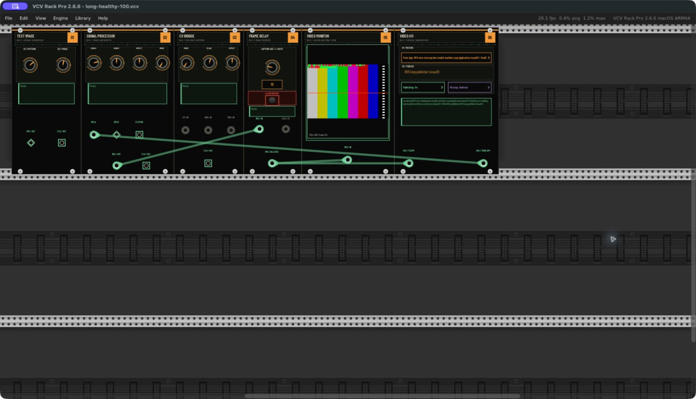 | 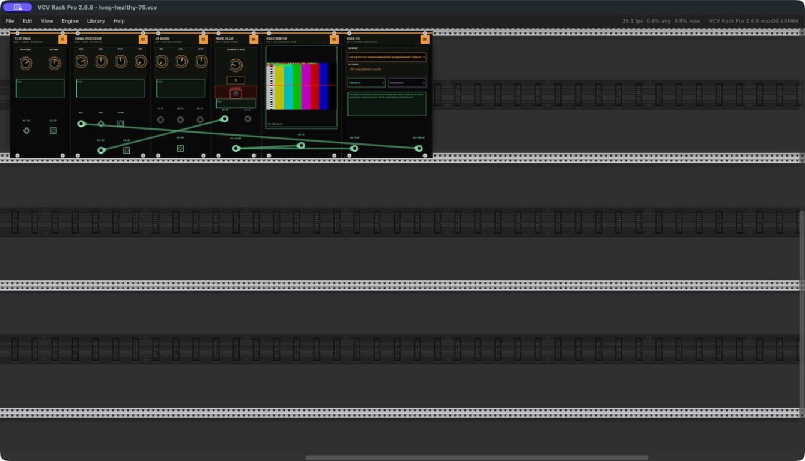 |
| Live server waiting for its first image | 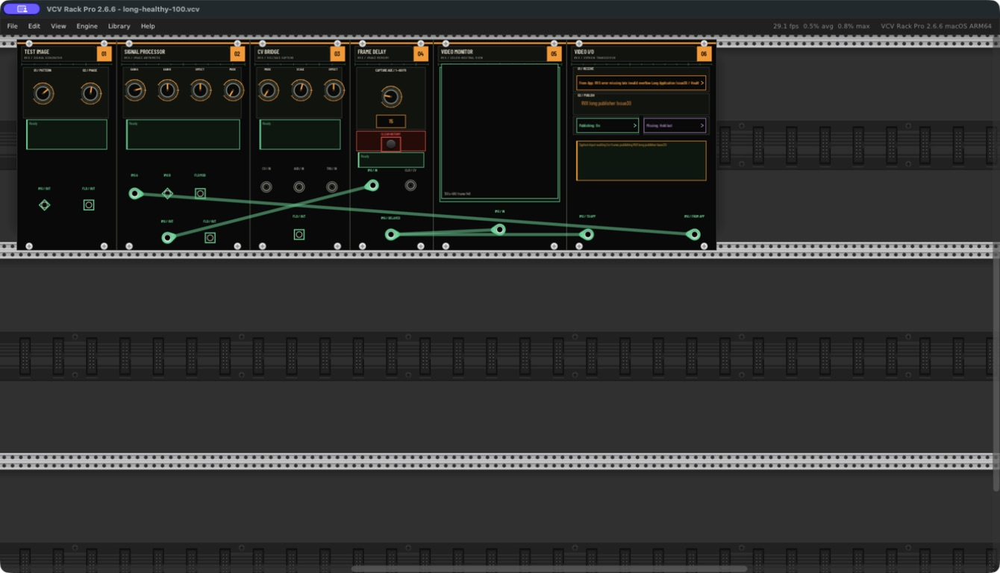 | 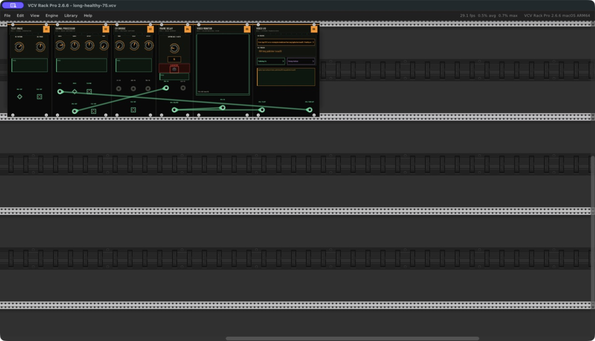 |
| Selected source absent | 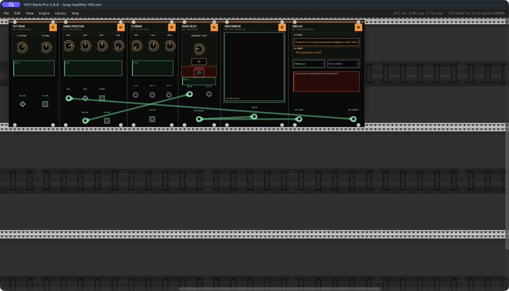 | 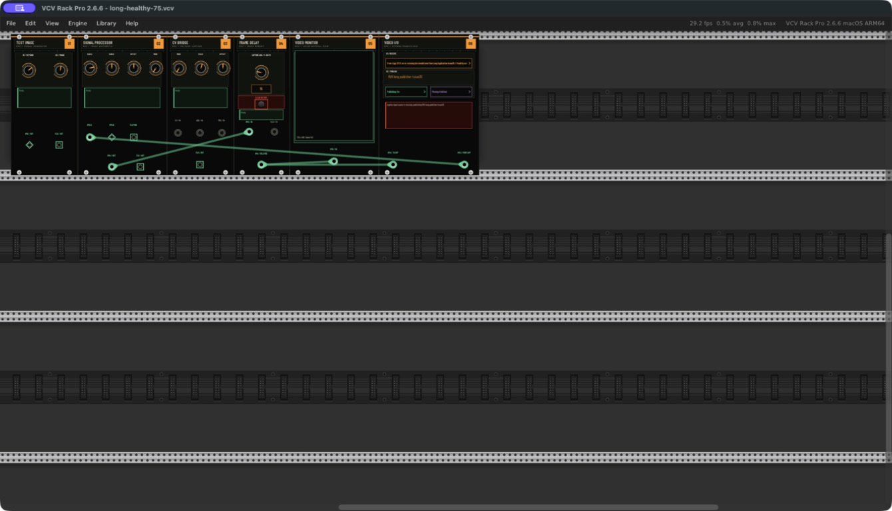 |

### Included examples

The source patches are the unchanged files under `examples/` at the runtime revision. The [contract comparison](native/issue30/example-contract-check.json) records exact source and native-saved JSON SHA-256 hashes, module counts and cable counts. The [native JSON snapshots](native/issue30/saved-examples/) were copied from the disposable profile's autosave immediately after reopening and saving each native-saved `.vcv`. Comparison used a `1e-6` tolerance for float parameter serialization; all original module/plugin/model IDs, parameter IDs/values and cable IDs/endpoints matched. Rack adds its normal version/parameter/default state during serialization; the comparison does not claim byte-identical patch files.

| Source patch | Native reload screenshot | Observation |
|---|---|---|
| `RVX-Phase-Patterns.vcv` | 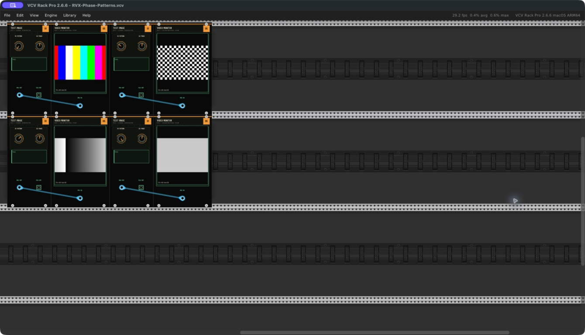 | Four Test Images and four Monitors; bars, checker, ramp and raster probe visible. |
| `RVX-Frame-Delay.vcv` | 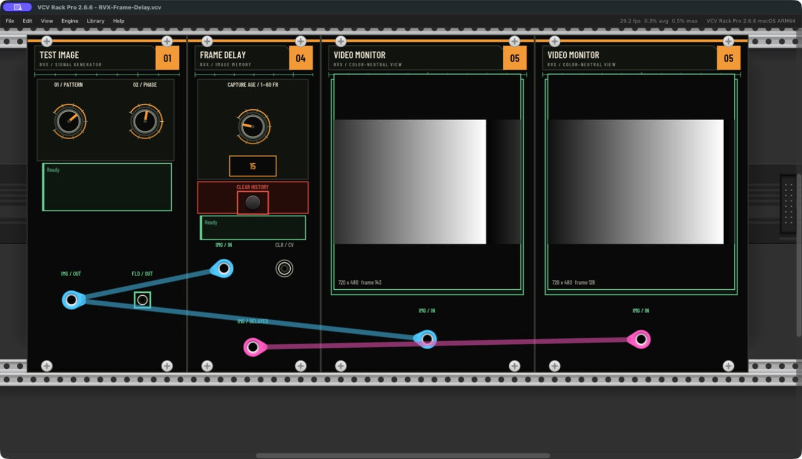 | Frames 15 and both ramp previews restored; original three cables retained. |
| `RVX-Audio-to-Video.vcv` | 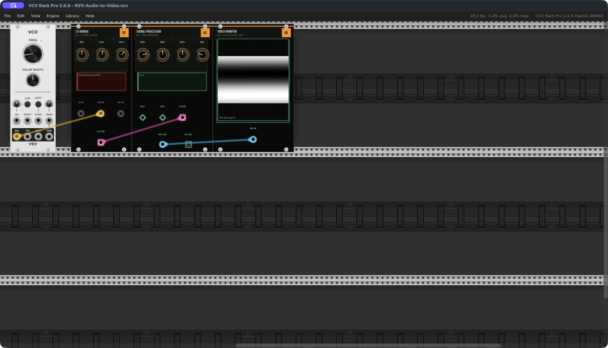 | Fundamental VCO 2.6.4, CV Bridge, processor and changing grayscale waveform restored; red clock-reanchoring diagnostic remains. |
| `RVX-Experimental-Chain.vcv` | 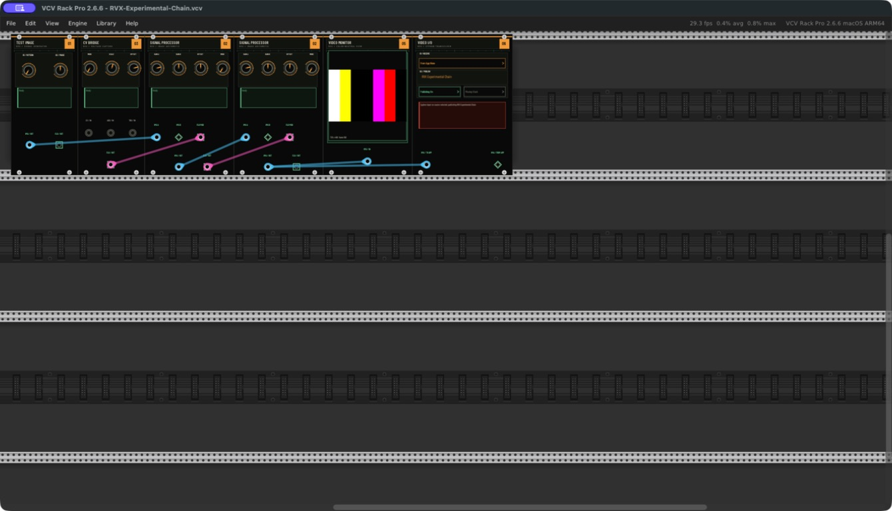 | Six modules and six cables restored; monitor active. Video I/O's absent input-source diagnostic is expected from the example's empty selection. |
| `RVX-Experimental-Feedback.vcv` | 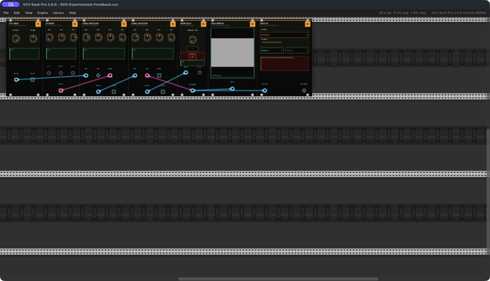 | Seven modules/seven cables restored, Frames 1 and active feedback preview. Empty Syphon selection remains explicit. |

For legible diagnostic inspection only, a disposable copy of the audio example was opened at 200% without altering its topology or controls. It showed `audio clock reanchored 155` / monitor frame 157 at `2026-09-09T21:41:15.552Z`, then `audio clock reanchored 672` / monitor frame 674 at `2026-09-09T21:41:32.700Z`. The grayscale waveform kept changing. This is an ongoing counter, not a transient startup-only message, and matches the already documented nondevice fallback clock correction in [prototype limits](../PROTOTYPE.md) and [native buffered-audio evidence](../VALIDATION.md). No physical audio module/device was selected. The disposable profile stored `sampleRate: 0` (automatic); its effective current rate was not exposed by the inspected native state, so the earlier 48 kHz observation is not transferred to this run.

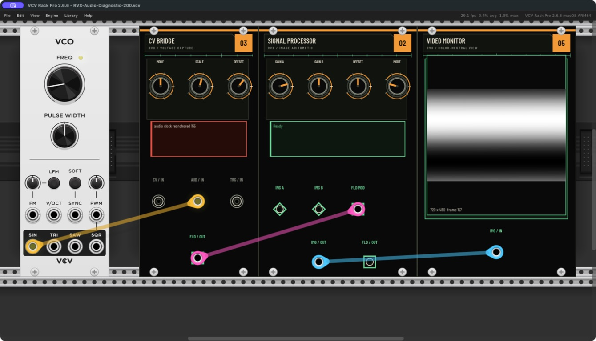

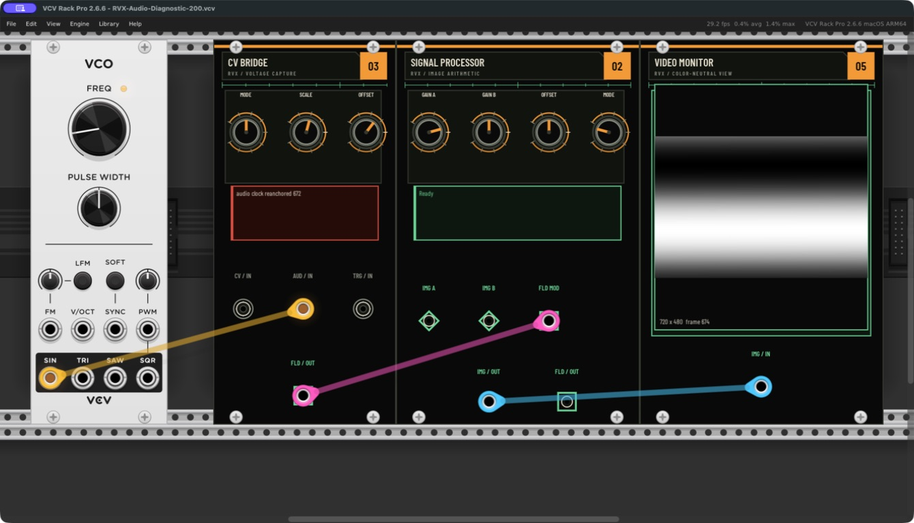

The [native session log excerpt](native/issue30/native-session.log) records patch loads/saves, fonts and scoped renderer/adapter diagnostics. Paths are normalized to `$VALIDATION_WORKTREE`. It supports the run provenance and advancing sequences, not seamless audio synchronization, physical reconnect, AV latency or the full #13 workload. The screenshot timestamp is the capture-completion timestamp; it is not a synchronized renderer clock.

### Checks and remaining gate

A clean native plugin build and native probe build passed with Rack SDK 2.6.6 and the pinned Syphon library. `make test-rack` passed the adapter and actual SDK host tests, including parameter snapping/clamping/reset/persistence and status classification. The waiting-source fixture compiled and advertised the intended image-less server, and the five native JSON comparisons passed. These checks complement the direct native observations; they do not substitute for Frames mouse/menu editing.

Issue #30 remains incomplete and its PR remains draft for native Frames dragging/context-menu entry at 1 and 60, Clear, reset and bypass. The exact failed bridge example was a canvas click at screenshot coordinate `[669, 87]` in a 1490×769 capture, transformed by the tool to `(1149.84375, 179.53125)` and rejected with `windowNotFoundAtPosition`. No hidden UI automation or synthetic pass was substituted. The earlier #20 historical observations and #18 numerical evidence remain scoped to their original revisions. Broader #13 lifecycle, physical-audio, latency, combined and fidelity gates stay open.
