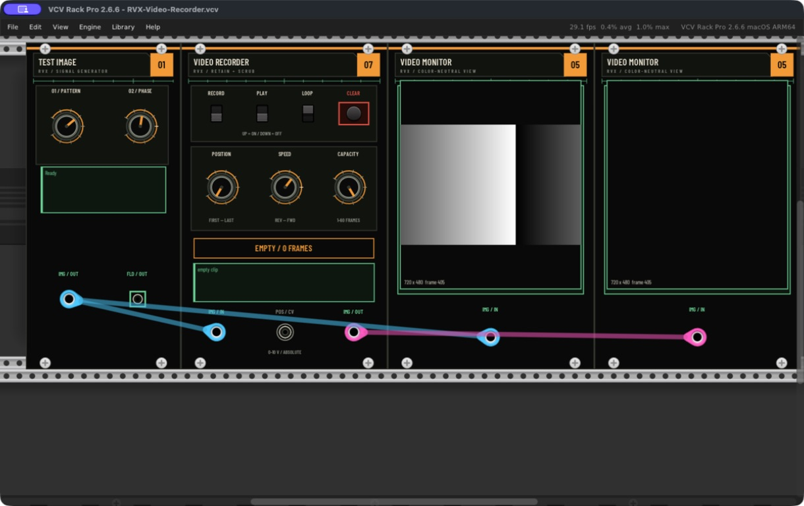
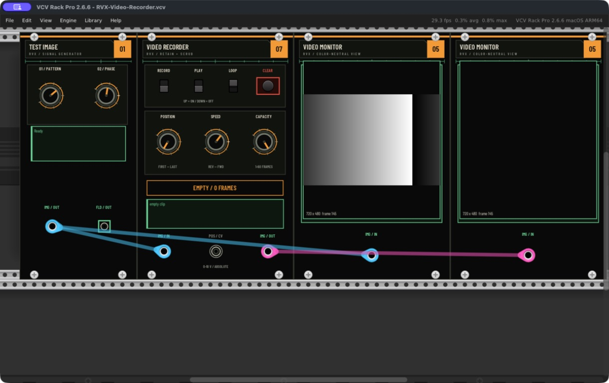
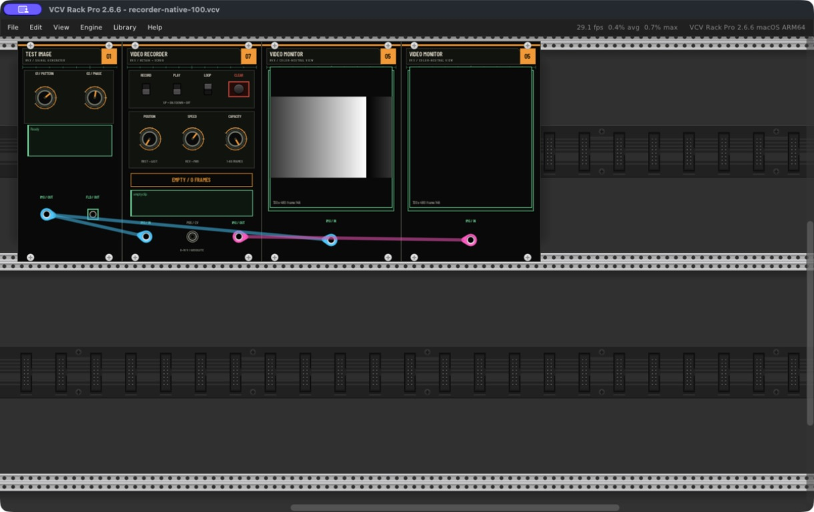
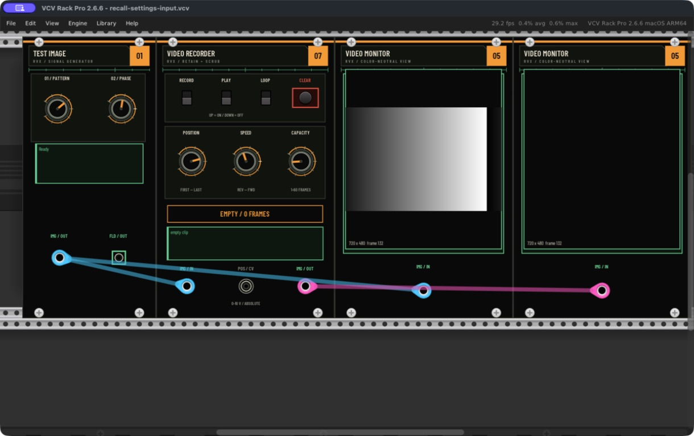

# Native Recorder observation — September 9, 2026

These are authentic Rack window observations of runtime `350524305f331594ba9240958d13c1bd7ca1c54c`, built in an isolated worker and installed only into `local.rvx.issue33.recorder-review`. The host is Rack Pro 2.6.6 standalone arm64 on Apple M4/macOS 26.2. The disposable profile specifies 48 kHz; no physical audio module/device or Syphon input is involved. Normal and older validation Rack profiles/patches were preserved. The issue33 host was closed with native Cmd-Q after capture.

The final source built successfully using `make -j4 all`, Rack SDK 2.6.6 and pinned Syphon `71351d4b484cd2d1917867f7846a5cdca724552d`. The root integration records numerical/SDK/sanitizer/package checks separately. This native record does not transfer those checks into direct UI interaction evidence.

## Observed

- The new Video Recorder panel renders in the existing theme at 100% and 150%. Record/Play/Loop/Clear, Position/Speed/Capacity, count/status and three ports are visible inside the panel. The `UP = ON / DOWN = OFF` legend is visible; Record/Play show down/off, and the example Loop shows up/on. Fine labels are smaller at 100%.
- The unchanged included `examples/RVX-Video-Recorder.vcv` opens, saves with native Cmd-S, and reopens through Rack's Open dialog. The live source ramp remains visible on the left Monitor, while the Recorder and right Monitor explicitly show the empty state/black output. All four module/model/parameter identities and values and all three cable IDs/endpoints match the native-saved JSON.
- A cold-recall settings fixture requests Record/Play on, Position 75%, Speed −0.5, Loop off and Capacity 12. Native recall restores Record/Play off, preserves the other settings and visibly reports `EMPTY / 0 FRAMES` and `empty clip`. This verifies safe control normalization on a cold load; it does **not** prove clearing a previously recorded clip on reload.

[manifest.json](manifest.json) records the exact source/example/plugin and artifact hashes plus scoped result flags. The two native JSON snapshots omit top-level local `path` metadata, and their recorded hashes identify those normalized copies. JSON comparisons check identities/values/endpoints, not byte-identical patch files. `writtenAtUtc` is the file-write time after capture, not a synchronized renderer clock.

## Native screenshots

Every image below was refreshed from runtime `350524305f331594ba9240958d13c1bd7ca1c54c`. The input ramp is live; no recorded clip exists in these images. The right Monitor's advancing frame counter on black does not establish recorded content.

The [recall input](recall-settings-input.vcv) contains requested settings only, without clip pixels. Compare [native recalled settings](recall-native-saved.json) and [native-saved example](example-native-saved.json). The [sanitized native session log](native-session-3505243.log) records font loading, patch load/save and scoped renderer/adapter diagnostics, with local paths normalized to `$VALIDATION_WORKTREE`. It is not a stress run or latency measurement.

## Remaining native interaction gate

Direct Record → Stop/retain → scrub, Position CV override, forward/reverse/loop playback, endpoint hold and Clear/reset/bypass with a captured clip remain unverified. No recorded/scrubbed native example was obtained. Issue #33's product-evidence criterion stays open; screenshots and cold fixtures do not satisfy it.

A timeboxed supported-computer-use attempt ran on initial runtime `2c98733445872dbc11a6f8dfae8edb3d0132d801`. Unlike the earlier #30 `windowNotFoundAtPosition` failures, the new app accepted calls but did not reliably target the requested control. In a 1220×768 screenshot, two left clicks at Record near `[328, 172]` and a short upward drag left native-saved Record and Play at 0 and the panel at `EMPTY / 0 FRAMES`. A right click at the same requested location opened an unrelated Video Monitor context menu near `[870, 462]`. Additional observed-point calibration did not establish a usable mapping. The cursor overlay and successful tool return therefore were not counted as successful parameter interactions. No hidden/shell UI automation or fixture-created clip was substituted. The repaired final revision was rebuilt and recaptured, without repeating these failed mouse attempts.

This is a tool-control limitation, not evidence that a correctly targeted physical mouse action fails. The narrow native panel/empty-recall observations above are useful independently, but do not reduce the recorded-clip interaction requirement or any existing #13/#18/#30 gate.
